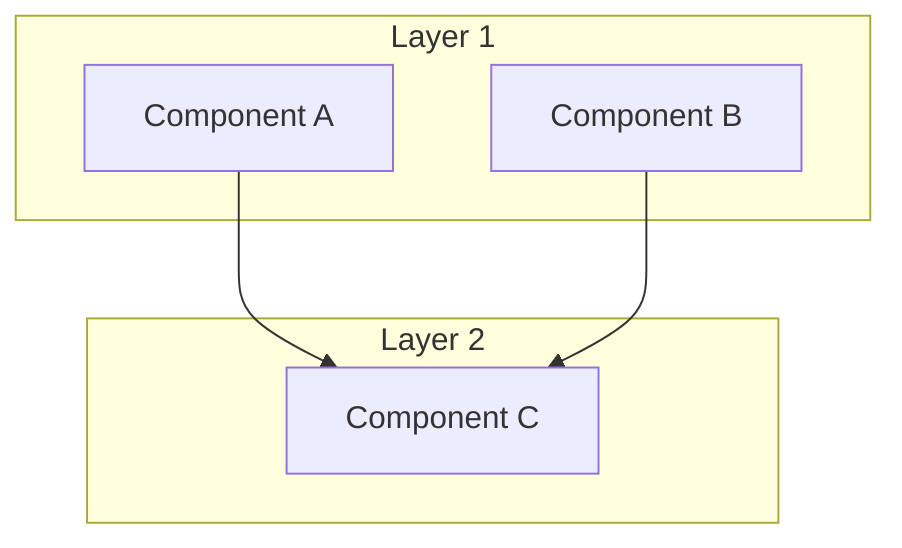
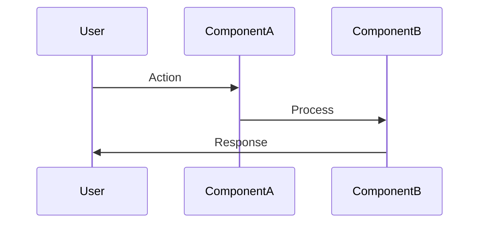

# Phase 3: 技术设计 (Design)

## 概述

技术设计阶段将需求转化为可实现的架构设计，并定义可测试的正确性属性 (Correctness Properties)。正确性属性是连接需求和测试的桥梁。

## 输入

- **默认模式**：`00-discovery.md`（需求发现文档）+ `01-requirements.md`（需求规范文档）
- **矩阵模式**：`01-requirements.md` + 上游需求文档与 INDEX 项目约束（00-discovery 默认跳过时）

## 输出

按运行模式二选一（模式定义见 [SKILL.md](../SKILL.md)）：

- **默认模式**：`.specs/{feature-name}/02-design.md`
- **矩阵模式**：`requirements-specs/{NN-layer}/{PREFIX-NNN-slug}/02-design.md`

## 正确性属性详解

### 什么是正确性属性？

正确性属性是对系统行为的形式化描述，具有以下特点：

1. **可测试**: 可以编写自动化测试验证
2. **可追溯**: 直接关联到需求
3. **无歧义**: 使用精确的数学/逻辑语言
4. **完备**: 覆盖所有相关需求

### 属性格式

```markdown
**Property N: [属性名称]**

*For any* [输入/条件], [系统] SHALL [行为/输出].

**Validates: Requirements X.Y, X.Z**
**Oracle: [oracle 类型] @ [验证环境]**
```

### 属性类型

#### 类型 1: 存在性属性 (Existence)

**格式**: *For any* X, there SHALL exist Y such that [条件].

**示例**:
```markdown
**Property 1: Chinese language entry exists**

*For any* rendering of AVAILABLE_LANGUAGES, there SHALL exist an entry
with value 'zh', label 'Chinese', and nativeLabel '简体中文'.

**Validates: Requirement 1.2**
```

---

#### 类型 2: 完整性属性 (Completeness)

**格式**: *For any* X in [集合], [系统] SHALL [包含/处理] X.

**示例**:
```markdown
**Property 2: All namespaces registered**

*For any* namespace in ['common', 'navigation', 'settings', 'tasks',
'welcome', 'onboarding', 'dialogs', 'taskReview'], the resources.zh
object SHALL contain that namespace as a key.

**Validates: Requirements 2.1, 2.2, 2.3**
```

---

#### 类型 3: 一致性属性 (Consistency)

**格式**: *For any* X and Y, if [条件], then [关系].

**示例**:
```markdown
**Property 3: Translation key completeness**

*For any* translation key path that exists in en/*.json,
the corresponding zh/*.json SHALL contain the same key path.

**Validates: Requirements 3.1-3.8**
```

---

#### 类型 4: 保持性属性 (Preservation)

**格式**: *For any* X with [特征], [操作] SHALL preserve [特征].

**示例**:
```markdown
**Property 4: Interpolation placeholder preservation**

*For any* English translation string containing {{...}} placeholders,
the corresponding Chinese translation SHALL contain the same placeholders.

**Validates: Requirement 6.3**
```

---

#### 类型 5: 回退性属性 (Fallback)

**格式**: *For any* X where [条件不满足], [系统] SHALL [回退行为].

**示例**:
```markdown
**Property 5: Fallback to English**

*For any* missing translation key in Chinese resources,
the i18n framework SHALL return the English translation value.

**Validates: Requirement 5.1**
```

---

### Oracle 声明 (Oracle Declaration)

每个 Correctness Property（以及由它派生的 AC）必须声明用什么手段、在什么环境验证：

- **oracle 类型**：源码 grep（仓库级不变量）/ HTTP 抓取 / 浏览器 DOM（Playwright）/ DB truth / 执行证据
- **验证环境**：dev / prod build（pnpm start）/ standalone 容器 / 灰度

**oracle 选择规则**:

1. 验收判据写成**仓库级不变量**（如「全仓 grep 归零（白名单外）」）；文件清单只是工作项，不是验证边界——字面值可能藏在圈定文件之外（如翻译资源串），只有仓库级 grep 才撞得出来
2. CSR-bailout（客户端渲染）内容用源码 grep 或真浏览器验证，勿用 curl（curl 抓不到 client 渲染后的 DOM，得到假阴性）
3. 门命令必须**先对基线试跑**（确认工具存在、基线的通过/失败方向符合预期），再写进 spec

**示例**:
```markdown
**Oracle: 源码 grep（仓库级不变量：全仓 grep 归零，白名单见 Task X.Y） @ prod build（pnpm start）**
```

> 防止的失败类别：oracle 与验证对象错配——用 curl 验证 CSR 内容得到假阴性；按 6 文件圈定 grep 漏掉圈外残留字面值；门命令本身不存在或红绿方向写反导致门永远虚绿。

---

## Prework Analysis

### 什么是 Prework Analysis？

在定义正确性属性之前，对每个需求进行分析，确定：
1. 如何验证该需求
2. 是否可以编写自动化测试
3. 测试类型（属性测试 vs 示例测试）

### 分析格式

```markdown
### Prework Analysis

```
X.Y [需求简述]
  Thoughts: [如何验证？有什么挑战？]
  Testable: yes/no - property/example
```
```

### 分析示例

```markdown
### Prework Analysis

```
1.1 WHEN app initializes, I18nModule SHALL recognize 'zh' as valid
  Thoughts: Type system enforces this. Can verify by checking type includes 'zh'.
  Testable: yes - property

1.2 WHEN LanguageSettings renders, SHALL provide Chinese in AVAILABLE_LANGUAGES
  Thoughts: Array membership check. Can verify 'zh' exists with correct labels.
  Testable: yes - property

4.1 WHEN user selects Chinese, language SHALL change to 'zh'
  Thoughts: Requires runtime verification. Need to mock i18n.changeLanguage.
  Testable: yes - example (requires runtime)

6.1 TranslationFile SHALL use simplified Chinese consistently
  Thoughts: Manual review required. Cannot automate character set verification.
  Testable: no - manual review
```
```

### Testable 判断标准

| 类型 | 说明 | 自动化 |
|------|------|--------|
| yes - property | 可以用属性测试验证 | ✅ 完全自动化 |
| yes - example | 需要具体示例测试 | ✅ 部分自动化 |
| no - manual | 需要人工审查 | ❌ 手动验证 |

---

## 详细步骤

### Step 3.1: 架构设计

**操作**:
1. 分析现有架构
2. 设计新组件/修改
3. 绘制架构图
4. 定义数据流

**架构图格式** (Mermaid):
```markdown
## Architecture


```

**数据流图格式**:
```markdown
## Data Flow


```

**外部依赖设计分叉：限时 spike 规则**

当设计在两个依赖外部系统行为的方案间二选一（如「调用外部组件的动态端点」vs「生成静态配置」），且纸面论证无法裁决时，**先做限时 spike（≤半天）拿一手探针证据再定案**：

1. 实际调用目标端点 / 跑最小原型，确认能力存在性、返回语义、副作用（如双真相源 split-brain 风险）
2. 把裁决结论与否决理由（含探针证据）写入设计文档的决策记录；未选方案的升级条件留 tripwire
3. spike 超时仍无法裁决 → 选可逆性更高的方案并记录复议触发条件

> 防止的失败类别：纸面裁决外部系统能力——按文档假设选型，实施时才发现端点不存在/语义不符，或忽视双真相源副作用被迫返工。

---

### Step 3.2: 组件和接口设计

**操作**:
1. 定义新增/修改的类型
2. 定义接口签名
3. 说明修改点

**格式**:
```markdown
## Components and Interfaces

### [组件名称] (新增/修改)

```typescript
// 文件路径
export type NewType = 'a' | 'b' | 'c';

export interface NewInterface {
  property: Type;
  method(param: Type): ReturnType;
}
```

**修改说明**:
- 新增 [xxx]
- 修改 [xxx] 从 [旧] 到 [新]
```

---

### Step 3.3: 数据模型设计

**操作**:
1. 定义数据结构
2. 说明存储方式
3. 定义验证规则

**格式**:
```markdown
## Data Models

### [模型名称]

```typescript
interface ModelName {
  field1: Type;  // 说明
  field2: Type;  // 说明
}
```

**验证规则**:
- field1: [规则]
- field2: [规则]

**存储位置**: [文件路径/数据库表]
```

---

### Step 3.4: 外部状态写语义检查

**目标**: 凡设计依赖读取外部状态（cookie / header / env / DB 行 / 缓存键）做行为判定，必须核清**谁在何时写它、写什么值**，而不是只核「名字一致」

**操作**:
1. 列出设计中所有被读取的外部状态及其判定谓词（如「cookie 存在 ⟹ 用户已做过选择」）
2. 对每个状态 grep/实测**全部写入方**：哪些代码、中间件、框架默认行为会写它，在什么时机，写什么值
3. 验证判定谓词在真实写入时序下依然成立；不成立则修正谓词（如从「存在性判定」改为「值差异判定」）
4. 把写入方清单与谓词结论登记进设计文档

**产物格式**:
```markdown
## 外部状态写语义

| 状态 | 读取判定谓词 | 写入方（谁/何时/写什么） | 谓词是否成立 |
|------|-------------|------------------------|-------------|
| [cookie X] | [谓词] | [写入方清单] | ✅ / ❌ → 修正为 [...] |
```

> 防止的失败类别：UI-004 类外部状态误读——名字一致性核对通过、R_eff 达标，但框架中间件无条件预写该状态，核心判定谓词恒假，目标人群永远看不到功能（对抗验证判 FAIL，P0 级功能性逃逸）。此类风险在 FPF 能力边界之外（FPF 只承保文档内部一致性 + 已核对锚点，不承保外部状态写语义），必须在设计阶段核清。

---

### Step 3.5: 消费路径盘点 (Consumer-Path Inventory)

**目标**: 凡改动一条业务规则/常量，列出**全部消费它的代码路径**，防止只改发起侧、漏掉展示/门控/文档侧

**操作**:
1. grep 规则源（常量 / 配置键 / 函数）的所有读取点
2. 按类别归组：发放/结算侧、展示/storefront 侧、门控（gate）侧、文档/文案侧、测试/fixture 侧
3. 每条路径标注处置：本次改动覆盖（映射到任务）/ 显式排除（写明理由）
4. 该清单在 Phase 4 转成追溯矩阵的「paths covered」核对面——每条路径必须映射到任务或显式排除

**产物格式**:
```markdown
## 消费路径盘点

规则源: [file:symbol]

| 消费路径 | 类别 | 处置 |
|---------|------|------|
| [file:line] | 结算 | 本次覆盖（Task X.Y） |
| [file:line] | 展示 | 显式排除：[理由] |
```

> 防止的失败类别：单点改规则、多点消费漂移——运行时规则源改了，展示层/文档/守门测试仍持旧值，用户看到与实际计费不符的数字。

---

### Step 3.6: Prework Analysis

**操作**:
1. 列出所有需求
2. 分析每个需求的可测试性
3. 确定测试方法

**输出**: Prework Analysis 表格

---

### Step 3.7: 定义正确性属性

**操作**:
1. 根据 Prework Analysis 结果
2. 为可测试的需求定义属性
3. 确保属性覆盖所有需求

**属性编写检查**:
- [ ] 使用 *For any* 开头
- [ ] 使用 SHALL 表示约束
- [ ] 关联到具体需求
- [ ] 可以编写测试代码
- [ ] 每个属性带 Oracle 声明（oracle 类型 + 验证环境，见「Oracle 声明」小节）

---

### Step 3.8: 错误处理设计

**操作**:
1. 识别可能的错误场景
2. 定义处理策略
3. 设计用户反馈

**格式**:
```markdown
## Error Handling

### Error Scenarios

| 场景 | 处理方式 | 用户影响 |
|------|---------|---------|
| [场景1] | [处理] | [影响] |

### Validation Strategy

1. **构建时**: [策略]
2. **运行时**: [策略]
3. **测试时**: [策略]
```

---

### Step 3.9: 测试策略设计

**操作**:
1. 选择测试框架
2. 设计测试结构
3. 编写测试示例

**格式**:
```markdown
## Testing Strategy

### Framework
- 单元测试: [框架]
- 属性测试: [框架]
- 集成测试: [框架]

### Test Structure
```
src/__tests__/
├── unit/
│   └── [feature].test.ts
├── property/
│   └── [feature].property.test.ts
└── integration/
    └── [feature].integration.test.ts
```

### Test Examples

```typescript
// Property test example
describe('[Feature] Properties', () => {
  it('Property 1: [name]', () => {
    // Test implementation
  });
});
```
```

---

### Step 3.10: 编写 02-design.md

**代码锚点基线约定**:

- 设计文档中所有 `file:line` 代码引用必须附核对日期——全文一处基线声明即可：「本文档全部 file:line 锚点于 YYYY-MM-DD 对当前 HEAD 逐一核对」
- 优先用函数名/常量名等**语义锚点**，行号视为装饰性（实测普遍 ±1~3 漂移）
- 实施前基线超期（尤其批量波次实施使早波改动令锚点失效时），必须按前提复核（Phase 6 Step 6.0）重验
- **删除类任务以语义边界为准，不以行号硬切**：写「删除函数 X 整体 / 常量 Y 及其导出」，不写「删除 L120-L180」
- 数量断言（「共 N 处调用点 / N 个文件」）与行号核对是**独立检查项**，均须在写入时刻新鲜 grep 导出，禁止沿用文档间互相引用的数字

> 防止的失败类别：锚点漂移误删/漏改——批量实施后行号错位，按行号硬切会切错代码；行号锚点逐条核对通过 ≠ 数量断言已核对。

**文档结构**:
```markdown
# Feature Design: [功能名称]

## Overview
[设计概述和关键决策；外部依赖分叉的 spike 裁决记录在此]

## Architecture
[架构图]

## Data Flow
[数据流图]

## Components and Interfaces
[组件和接口定义]

## Data Models
[数据模型定义]

## 外部状态写语义
[Step 3.4 产物；无外部状态依赖时注明「不适用」]

## 消费路径盘点
[Step 3.5 产物；非业务规则改动时注明「不适用」]

## Correctness Properties

### Prework Analysis
[分析表格]

### Properties
[正确性属性列表，每条带 Oracle 声明]

## Error Handling
[错误处理设计]

## Testing Strategy
[测试策略]

## File Changes Summary
[文件变更汇总表]

## 代码锚点基线
[本文档全部 file:line 锚点于 YYYY-MM-DD 对当前 HEAD 逐一核对]

## 审批状态
- [ ] 用户确认架构设计
- [ ] 用户确认正确性属性
- [ ] 用户批准进入 Phase 4
（批量授权模式下由批次级一次性授权记录替代，见 SKILL.md「批量模式（Batch Mode）」）
```

---

## 验证检查清单

### 架构检查

- [ ] **架构图清晰**
  - 组件关系明确
  - 层次结构合理

- [ ] **接口定义完整**
  - 类型签名正确
  - 参数和返回值明确

- [ ] **数据流清晰**
  - 输入输出明确
  - 处理步骤完整

- [ ] **外部依赖分叉已裁决**
  - 二选一方案有 spike 一手证据，或声明纸面可裁决的依据
  - 裁决与否决理由已写入设计文档

### 设计核查

- [ ] **外部状态写语义已核**
  - 每个被读取的外部状态列出全部写入方（谁/何时/写什么）
  - 判定谓词在真实写入时序下成立（或已注明「不适用」）

- [ ] **消费路径已盘点**
  - 业务规则改动列出全部读取点并逐条标注处置（或已注明「不适用」）

### 属性检查

- [ ] **Prework Analysis 完成**
  - 所有需求已分析
  - 可测试性已判断

- [ ] **属性覆盖完整**
  - 每个可测试需求有对应属性
  - 无遗漏需求

- [ ] **属性可测试**
  - 可以编写测试代码
  - 测试方法明确

- [ ] **Oracle 已声明**
  - 每个属性带 oracle 类型 + 验证环境
  - 判据为仓库级不变量而非文件清单；门命令已对基线试跑

### 追溯检查

- [ ] **需求追溯**
  - 每个属性关联到需求
  - 使用 "Validates: Req X.Y" 格式

- [ ] **文件变更追溯**
  - 所有修改文件已列出
  - 修改类型已标注

- [ ] **代码锚点基线**
  - 全文 file:line 锚点有核对日期声明
  - 删除类改动以语义边界描述；数量断言经新鲜 grep 导出

---

## 常见问题

### Q1: 如何处理无法自动测试的需求？

**解决方案**:
1. 在 Prework Analysis 中标注 `Testable: no`
2. 定义手动验证步骤
3. 在测试策略中说明手动测试方法

### Q2: 属性太复杂怎么办？

**解决方案**:
1. 拆分为多个简单属性
2. 使用辅助函数封装复杂逻辑
3. 确保每个属性独立可测试

### Q3: 如何处理跨组件的属性？

**解决方案**:
1. 定义集成测试属性
2. 使用 mock 隔离依赖
3. 在测试策略中说明集成测试方法

---

## 时间估算

| 步骤 | 简单功能 | 中等功能 | 复杂功能 |
|------|---------|---------|---------|
| 架构设计 | 20 min | 45 min | 90 min |
| 组件接口 | 15 min | 30 min | 60 min |
| 数据模型 | 10 min | 20 min | 45 min |
| 外部状态/消费路径核查 | 10 min | 20 min | 40 min |
| Prework | 15 min | 30 min | 60 min |
| 属性定义（含 Oracle 声明） | 20 min | 45 min | 90 min |
| 错误处理 | 10 min | 20 min | 30 min |
| 测试策略 | 15 min | 30 min | 45 min |
| 文档整理 | 15 min | 30 min | 45 min |
| **总计** | **130 min** | **270 min** | **505 min** |

> 外部依赖分叉的限时 spike（≤半天）不计入上表，按需单列。

---

## 相关链接

- [返回主文档](../SKILL.md)
- [上一阶段: Phase 2 需求规范](./phase2-requirements.md)
- [下一阶段: Phase 4 任务清单](./phase4-tasks.md)
- [模板文件](../templates/02-design.template.md)
