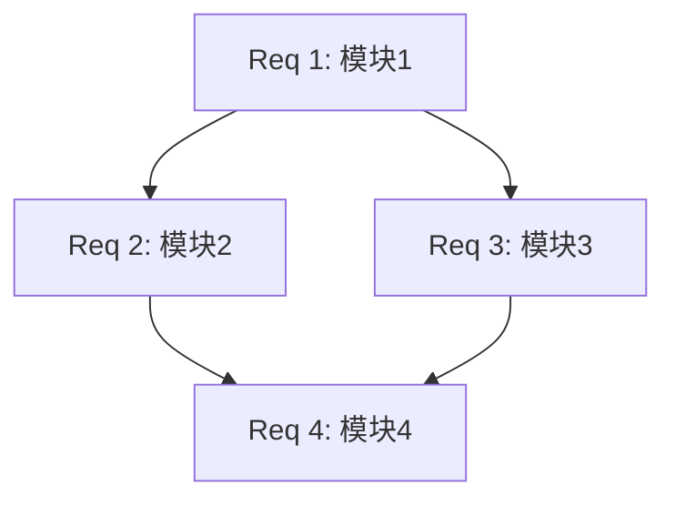

# Requirements Document: [功能名称]

> 模板版本: 2.0
> 创建日期: YYYY-MM-DD
> 基于: 00-discovery.md
> 阻塞决策: [决策ID] / [状态 open|decided] / [拍板值]（无阻塞决策则填「无」）

<!-- 存在未拍板（open）的阻塞决策时，受影响需求必须写成条件组（方案 A/B/C 各一组 EARS 需求，拍板后 Status 转出 + 拍板记录回填 + 未选分支保留存档），写法见 operations/phase2-requirements.md -->

## Introduction

[功能简介：一段话描述功能的目的和价值]

**目标用户**: [目标用户群体]

**核心价值**: [功能带来的核心价值]

---

## Glossary

> 从 00-discovery.md 复制并根据需要扩展

| 英文 | 中文 | 定义 | 使用上下文 |
|------|------|------|------------|
| [Term1] | [术语1] | [定义说明] | [在哪里使用] |
| [Term2] | [术语2] | [定义说明] | [在哪里使用] |

---

## Requirements

### Requirement 1: [模块/功能名称]

**User Story:** As a [角色], I want [功能], so that [价值].

#### Acceptance Criteria

1.1 WHEN [触发条件], THE [系统/模块] SHALL [动作/行为].
- 验证方法: [如何测试]
- 预期结果: [具体结果]

1.2 THE [系统/模块] SHALL [动作/行为].
- 验证方法: [如何测试]
- 预期结果: [具体结果]

1.3 IF [条件], THEN THE [系统/模块] SHALL [动作/行为].
- 验证方法: [如何测试]
- 预期结果: [具体结果]

---

### Requirement 2: [模块/功能名称]

**User Story:** As a [角色], I want [功能], so that [价值].

#### Acceptance Criteria

2.1 WHEN [触发条件], THE [系统/模块] SHALL [动作/行为].
- 验证方法: [如何测试]
- 预期结果: [具体结果]

2.2 THE [系统/模块] SHALL [动作/行为].
- 验证方法: [如何测试]
- 预期结果: [具体结果]

---

### Requirement 3: [模块/功能名称]

**User Story:** As a [角色], I want [功能], so that [价值].

#### Acceptance Criteria

3.1 [EARS 格式需求]
- 验证方法: [如何测试]
- 预期结果: [具体结果]

---

### Requirement 4: [模块/功能名称]

**User Story:** As a [角色], I want [功能], so that [价值].

#### Acceptance Criteria

4.1 [EARS 格式需求]
- 验证方法: [如何测试]
- 预期结果: [具体结果]

---

### Requirement 5: [异常处理/回退机制]

**User Story:** As a [角色], I want [功能], so that [价值].

#### Acceptance Criteria

5.1 IF [异常条件], THEN THE [系统/模块] SHALL [处理方式].
- 验证方法: [如何测试]
- 预期结果: [具体结果]

5.2 IF [异常条件], THEN THE [系统/模块] SHALL [处理方式].
- 验证方法: [如何测试]
- 预期结果: [具体结果]

---

### Requirement 6: [质量标准] (可选)

**User Story:** As a [角色], I want [功能], so that [价值].

#### Acceptance Criteria

6.1 THE [系统/模块] SHALL [质量标准].
- 验证方法: [如何测试]
- 预期结果: [具体结果]

---

## EARS 模式参考

> 编写需求时参考以下模式

| 模式 | 格式 | 适用场景 |
|------|------|---------|
| 普遍型 | THE [system] SHALL [action] | 系统必须具备的能力 |
| 事件驱动型 | WHEN [trigger], THE [system] SHALL [action] | 响应特定事件 |
| 条件型 | IF [condition], THEN THE [system] SHALL [action] | 特定条件下的行为 |
| 可选特性型 | WHERE [feature enabled], THE [system] SHALL [action] | 可配置功能 |

---

## 需求汇总

| ID | 需求简述 | 类型 | 优先级 |
|----|---------|------|--------|
| 1.1 | [简述] | 功能 | 高 |
| 1.2 | [简述] | 功能 | 高 |
| 2.1 | [简述] | 功能 | 中 |
| 5.1 | [简述] | 异常处理 | 高 |

---

## 需求依赖关系

---

## 非功能需求 (可选)

### 性能需求

| ID | 需求 | 指标 |
|----|------|------|
| NFR-1 | [性能需求] | [具体指标，如 < 200ms] |

### 安全需求

| ID | 需求 | 说明 |
|----|------|------|
| NFR-2 | [安全需求] | [具体说明] |

---

## Notes

### 假设

1. [假设1]
2. [假设2]

### 依赖

1. [依赖1]
2. [依赖2]

### 排除范围

以下内容**不在**本功能范围内：
1. [排除项1]
2. [排除项2]

---

## 审批状态

| 审批项 | 状态 | 审批人 | 日期 |
|--------|------|--------|------|
| 需求完整性 | ⏳ 待审批 | | |
| 术语翻译 | ⏳ 待审批 | | |
| 进入 Phase 3 | ⏳ 待审批 | | |

> 批量授权模式下本表由批次级一次性授权记录替代（记入 INDEX 或批次文档，见 SKILL.md「批量模式（Batch Mode）」），逐项审批不适用。

---

**文档历史**

| 版本 | 日期 | 作者 | 变更说明 |
|------|------|------|---------|
| 0.1 | YYYY-MM-DD | [姓名] | 初稿 |
