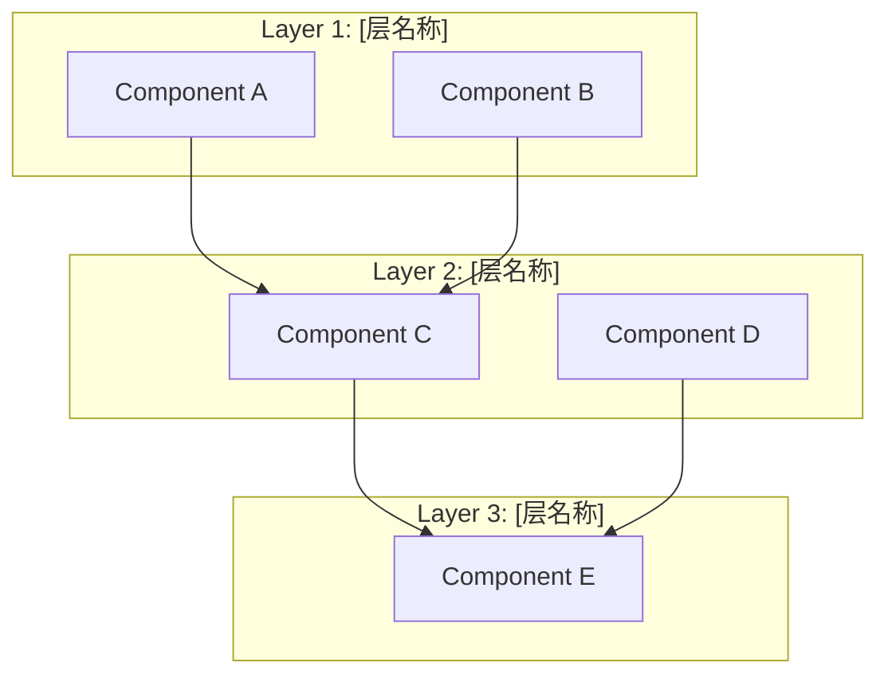
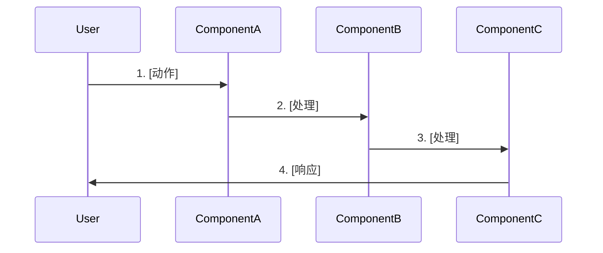

# Feature Design: [功能名称]

> 模板版本: 2.0
> 创建日期: YYYY-MM-DD
> 基于: 01-requirements.md
> 代码锚点基线: 本文档全部 file:line 引用已于 YYYY-MM-DD 对照当前 HEAD 逐一核对

<!-- 代码锚点基线：写设计时逐一 grep/Read 核对所有 file:line 引用并填入日期；实施前若基线超期须重验（Phase 6 Step 6.0 前提复核）；删除任务以语义边界为准，不以行号硬切 -->

## Overview

[设计概述：一段话描述整体设计思路和关键决策]

### Key Design Decisions

1. **[决策1标题]**: [决策说明和理由]
2. **[决策2标题]**: [决策说明和理由]
3. **[决策3标题]**: [决策说明和理由]

---

## 硬约束遵循

<!-- 从上游需求文档 / INDEX 项目约束清单继承，逐条列出并声明遵守方式；设计与约束冲突时先回上游拍板，不得静默偏离 -->

| # | 硬约束（来源：上游需求文档 / INDEX 约束清单） | 本设计的遵守方式 |
|---|---------------------------------------------|-----------------|
| 1 | [约束原文] | [遵守方式 / 不涉及的理由] |
| 2 | [约束原文] | [遵守方式 / 不涉及的理由] |

---

## Architecture



### 架构说明

| 层 | 组件 | 职责 |
|----|------|------|
| Layer 1 | Component A | [职责说明] |
| Layer 1 | Component B | [职责说明] |
| Layer 2 | Component C | [职责说明] |

---

## Data Flow



### 数据流说明

1. **[步骤1]**: [说明]
2. **[步骤2]**: [说明]
3. **[步骤3]**: [说明]

---

## Components and Interfaces

### [组件1名称] (修改/新增)

```typescript
// 文件路径: path/to/file.ts

// 类型定义
export type TypeName = 'value1' | 'value2' | 'value3';

// 接口定义
export interface InterfaceName {
  property1: Type;
  property2: Type;
  method(param: Type): ReturnType;
}

// 常量定义
export const CONSTANT_NAME = [
  { key: 'value1', label: 'Label 1' },
  { key: 'value2', label: 'Label 2' },
] as const;
```

**修改说明**:
- 新增: [新增内容]
- 修改: [修改内容，从 X 到 Y]

---

### [组件2名称] (修改/新增)

```typescript
// 文件路径: path/to/file.ts

// 代码示例
```

**修改说明**:
- [修改说明]

---

## Data Models

### [模型1名称]

```typescript
// 文件路径: path/to/file.ts

interface ModelName {
  field1: string;      // [字段说明]
  field2: number;      // [字段说明]
  field3: boolean;     // [字段说明]
  field4?: OptionalType; // [可选字段说明]
}
```

**验证规则**:
| 字段 | 规则 | 说明 |
|------|------|------|
| field1 | 非空 | [说明] |
| field2 | > 0 | [说明] |

**存储位置**: [文件路径/数据库表]

---

## Correctness Properties

### Prework Analysis

```
1.1 [需求简述]
  Thoughts: [如何验证？有什么挑战？]
  Testable: yes/no - property/example

1.2 [需求简述]
  Thoughts: [如何验证？]
  Testable: yes - property

2.1 [需求简述]
  Thoughts: [如何验证？]
  Testable: yes - property

3.1 [需求简述]
  Thoughts: [如何验证？]
  Testable: yes - property

4.1 [需求简述]
  Thoughts: [需要运行时验证]
  Testable: yes - example

5.1 [需求简述]
  Thoughts: [如何验证？]
  Testable: yes - property

6.1 [需求简述]
  Thoughts: [需要人工审查]
  Testable: no - manual review
```

---

### Properties

<!-- 每个 Property 必须声明 oracle（Oracle Declaration）：oracle 类型 = 源码 grep（仓库级不变量）/ HTTP 抓取 / 浏览器 DOM（Playwright）/ DB truth / 执行证据；验证环境 = dev / prod build（pnpm start）/ standalone 容器 / 灰度。验收判据写成仓库级不变量，文件清单只是工作项不是验证边界 -->

**Property 1: [属性名称]**

*For any* [输入/条件], [系统/组件] SHALL [行为/输出].

**Oracle**: [oracle 类型] ｜ 验证环境: [验证环境]

**Validates: Requirements 1.1, 1.2**

---

**Property 2: [属性名称]**

*For any* [输入/条件], there SHALL exist [结果] such that [条件].

**Oracle**: [oracle 类型] ｜ 验证环境: [验证环境]

**Validates: Requirements 2.1**

---

**Property 3: [属性名称]**

*For any* X in [集合], [系统/组件] SHALL [包含/处理] X.

**Oracle**: [oracle 类型] ｜ 验证环境: [验证环境]

**Validates: Requirements 3.1, 3.2, 3.3**

---

**Property 4: [属性名称]**

*For any* X that exists in [源], the corresponding Y SHALL [关系].

**Oracle**: [oracle 类型] ｜ 验证环境: [验证环境]

**Validates: Requirements 4.1**

---

**Property 5: [属性名称]**

*For any* X with [特征], [操作] SHALL preserve [特征].

**Oracle**: [oracle 类型] ｜ 验证环境: [验证环境]

**Validates: Requirements 5.1**

---

**Property 6: [属性名称]**

*For any* missing X in [源], [系统] SHALL [回退行为].

**Oracle**: [oracle 类型] ｜ 验证环境: [验证环境]

**Validates: Requirements 6.1**

---

## Error Handling

### Error Scenarios

| 场景 | 处理方式 | 用户影响 |
|------|---------|---------|
| [场景1] | [处理] | [影响] |
| [场景2] | [处理] | [影响] |
| [场景3] | [处理] | [影响] |

### Validation Strategy

1. **构建时**: [策略，如 TypeScript 编译检查]
2. **测试时**: [策略，如属性测试验证]
3. **运行时**: [策略，如回退机制]

---

## Testing Strategy

### Framework

| 测试类型 | 框架 | 说明 |
|---------|------|------|
| 单元测试 | [框架] | [说明] |
| 属性测试 | [框架] | [说明] |
| 集成测试 | [框架] | [说明] |

### Test Configuration

- 属性测试迭代次数: 100
- 测试文件位置: `src/__tests__/[feature]/`

### Test Structure

```
src/__tests__/
└── [feature]/
    ├── [feature].test.ts           # 单元测试
    ├── [feature].property.test.ts  # 属性测试
    └── [feature].integration.test.ts # 集成测试
```

### Unit Tests

```typescript
// src/__tests__/[feature]/[feature].test.ts

describe('[Feature] Unit Tests', () => {
  // Property 1
  it('should [测试描述]', () => {
    // Test implementation
  });

  // Property 2
  it('should [测试描述]', () => {
    // Test implementation
  });
});
```

### Property Tests

```typescript
// src/__tests__/[feature]/[feature].property.test.ts

describe('[Feature] Property Tests', () => {
  // Property 3: [属性名称]
  it('should [属性描述]', () => {
    // Property test implementation
  });

  // Property 4: [属性名称]
  it('should [属性描述]', () => {
    // Property test implementation
  });
});
```

---

## File Changes Summary

| 文件 | 操作 | 描述 |
|------|------|------|
| `path/to/file1.ts` | Modify | [修改说明] |
| `path/to/file2.ts` | Modify | [修改说明] |
| `path/to/new-file1.ts` | Create | [创建说明] |
| `path/to/new-file2.ts` | Create | [创建说明] |
| `src/__tests__/[feature]/*.test.ts` | Create | [测试文件] |

---

## 审批状态

| 审批项 | 状态 | 审批人 | 日期 |
|--------|------|--------|------|
| 架构设计 | ⏳ 待审批 | | |
| 正确性属性 | ⏳ 待审批 | | |
| 进入 Phase 4 | ⏳ 待审批 | | |

> 批量授权模式下本表由批次级一次性授权记录替代（记入 INDEX 或批次文档，见 SKILL.md「批量模式（Batch Mode）」），逐项审批不适用。

---

**文档历史**

| 版本 | 日期 | 作者 | 变更说明 |
|------|------|------|---------|
| 0.1 | YYYY-MM-DD | [姓名] | 初稿 |
