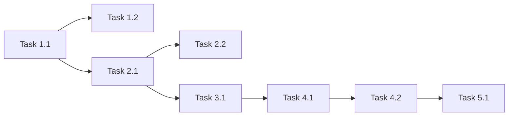

# Task List: [功能名称]

> 模板版本: 2.0
> 创建日期: YYYY-MM-DD
> 基于: 02-design.md

## Overview

**总任务数**: X
**预计工作量**: Y 小时
**优先级分布**: 高(A) / 中(B) / 低(C)

### 工作量统计

| 规模 | 数量 | 小时 |
|------|------|------|
| S (1-2h) | X | X-Xh |
| M (2-4h) | X | X-Xh |
| L (4-8h) | X | X-Xh |
| **总计** | **X** | **X-Xh** |

---

## Task Groups

### Group 1: [配置层/基础设施] (优先级: 高)

#### Task 1.1: [任务名称]

**Description**:
[具体描述要做什么]

**Files to modify**:
- `path/to/file1.ts` - [修改说明]
- `path/to/file2.ts` - [修改说明]

**Acceptance Criteria**:
- [ ] AC1: [具体标准]
- [ ] AC2: [具体标准]
- [ ] AC3: [具体标准]

**Validates**: Req X.Y, Req X.Z, Property N

**Dependencies**: None

**Estimated effort**: S

**Status**: [ ] 待开始

---

#### Task 1.2: [任务名称]

**Description**:
[具体描述要做什么]

**Files to modify**:
- `path/to/file.ts` - [修改说明]

**Acceptance Criteria**:
- [ ] AC1: [具体标准]
- [ ] AC2: [具体标准]

**Validates**: Req X.Y, Property N

**Dependencies**: Task 1.1

**Estimated effort**: S

**Status**: [ ] 待开始

---

### Group 2: [数据层/核心实现] (优先级: 高)

#### Task 2.1: [任务名称]

**Description**:
[具体描述要做什么]

**Files to modify**:
- `path/to/file1.ts` - [修改说明]
- `path/to/file2.ts` - [修改说明]
- `path/to/file3.ts` - [修改说明]

**Acceptance Criteria**:
- [ ] AC1: [具体标准]
- [ ] AC2: [具体标准]
- [ ] AC3: [具体标准]

**Validates**: Req X.Y, Req X.Z, Property N

**Dependencies**: Task 1.1

**Estimated effort**: L

**Status**: [ ] 待开始

---

#### Task 2.2: [任务名称]

**Description**:
[具体描述要做什么]

**Files to modify**:
- `path/to/file.ts` - [修改说明]

**Acceptance Criteria**:
- [ ] AC1: [具体标准]
- [ ] AC2: [具体标准]

**Validates**: Req X.Y, Property N

**Dependencies**: Task 2.1

**Estimated effort**: M

**Status**: [ ] 待开始

---

### Group 3: [集成层] (优先级: 中)

#### Task 3.1: [任务名称]

**Description**:
[具体描述要做什么]

**Files to modify**:
- `path/to/file.ts` - [修改说明]

**Acceptance Criteria**:
- [ ] AC1: [具体标准]
- [ ] AC2: [具体标准]

**Validates**: Req X.Y, Property N

**Dependencies**: Task 2.1

**Estimated effort**: S

**Status**: [ ] 待开始

---

### Group 4: [测试层] (优先级: 中)

#### Task 4.1: [任务名称 - 单元测试]

**Description**:
[具体描述要做什么]

**Files to modify**:
- `src/__tests__/[feature]/[feature].test.ts` - 创建

**Acceptance Criteria**:
- [ ] AC1: Property 1-N 都有对应测试
- [ ] AC2: 所有测试通过
- [ ] AC3: 测试覆盖率 > 80%

**Validates**: Property 1, Property 2, Property 3

**Dependencies**: Task 3.1

**Estimated effort**: M

**Status**: [ ] 待开始

---

#### Task 4.2: [任务名称 - 属性测试]

**Description**:
[具体描述要做什么]

**Files to modify**:
- `src/__tests__/[feature]/[feature].property.test.ts` - 创建

**Acceptance Criteria**:
- [ ] AC1: 属性测试覆盖所有 Property
- [ ] AC2: 所有测试通过

**Validates**: Property 4, Property 5, Property 6

**Dependencies**: Task 4.1

**Estimated effort**: M

**Status**: [ ] 待开始

---

### Group 5: [文档/收尾] (优先级: 低) (可选)

#### Task 5.1: [任务名称]

**Description**:
[具体描述要做什么]

**Files to modify**:
- `path/to/file.md` - [修改说明]

**Acceptance Criteria**:
- [ ] AC1: [具体标准]

**Validates**: N/A (文档任务)

**Dependencies**: Task 4.2

**Estimated effort**: S

**Status**: [ ] 待开始

---

## Traceability Matrix

| Requirement | Design Property | Task | Test |
|-------------|-----------------|------|------|
| Req 1.1 | Property 1 | Task 1.1 | test_xxx |
| Req 1.2 | Property 2 | Task 1.1 | test_xxx |
| Req 1.3 | Property 1 | Task 1.1 | test_xxx |
| Req 2.1 | Property 3 | Task 2.1, 3.1 | test_xxx |
| Req 2.2 | Property 3 | Task 3.1 | test_xxx |
| Req 2.3 | Property 3 | Task 3.1 | test_xxx |
| Req 3.1 | Property 4 | Task 2.1 | test_xxx |
| Req 3.2 | Property 4 | Task 2.1 | test_xxx |
| Req 4.1 | - | Task 3.1 | manual |
| Req 5.1 | Property 6 | Task 4.1 | test_xxx |
| Req 5.2 | Property 6 | Task 4.1 | test_xxx |
| Req 6.1 | Property 5 | Task 2.1 | test_xxx |

---

## Implementation Order

### 推荐执行顺序

1. **Phase A** (基础): Task 1.1 → Task 1.2
2. **Phase B** (核心): Task 2.1 → Task 2.2
3. **Phase C** (集成): Task 3.1
4. **Phase D** (测试): Task 4.1 → Task 4.2
5. **Phase E** (收尾): Task 5.1

---

## Progress Tracking

### 实施进度

<!-- Commit / 验证证据列：每组完成后填入库 commit hash 与验证命令+关键输出摘要——文件存在 ≠ 功能工作，无执行证据不得标记完成 -->

| Group | Total | Completed | Progress | Commit | 验证证据 |
|-------|-------|-----------|----------|--------|---------|
| 配置层 | 2 | 0 | 0% | [hash] | [命令+关键输出摘要] |
| 数据层 | 2 | 0 | 0% | [hash] | [命令+关键输出摘要] |
| 集成层 | 1 | 0 | 0% | [hash] | [命令+关键输出摘要] |
| 测试层 | 2 | 0 | 0% | [hash] | [命令+关键输出摘要] |
| 文档层 | 1 | 0 | 0% | [hash] | [命令+关键输出摘要] |
| **总计** | **8** | **0** | **0%** | | |

### 任务状态汇总

| 状态 | 数量 |
|------|------|
| [ ] 待开始 | 8 |
| [~] 进行中 | 0 |
| [x] 已完成 | 0 |
| [!] 阻塞 | 0 |

---

## Risk Items

| ID | 风险 | 影响任务 | 缓解措施 |
|----|------|---------|---------|
| R1 | [风险描述] | Task X.Y | [缓解措施] |
| R2 | [风险描述] | Task X.Y | [缓解措施] |

---

## Notes

### 实施注意事项

1. [注意事项1]
2. [注意事项2]

### 技术债务

1. [技术债务1] - 优先级: 低
2. [技术债务2] - 优先级: 低

---

## 审批状态

| 审批项 | 状态 | 审批人 | 日期 |
|--------|------|--------|------|
| 任务完整性 | ⏳ 待审批 | | |
| 工作量估算 | ⏳ 待审批 | | |
| 进入 Phase 5 (FPF) | ⏳ 待审批 | | |

> 批量授权模式下本表由批次级一次性授权记录替代（记入 INDEX 或批次文档，见 SKILL.md「批量模式（Batch Mode）」），逐项审批不适用。

---

## 收口记录

<!-- 实施闭环（Phase 6/7 完成）时写入本节；铁律：无收口记录 = 未收口；批量实施时每个 spec 都要写（含早波） -->

- **日期**: YYYY-MM-DD
- **状态判定**（五态词汇，固定拼写，选其一）:
  - `PASS`
  - `PARTIAL→已修复→PASS`
  - `FAIL→已修复`
  - `spec-premise-stale`（前提过期不实施，附裁决依据+引用取代方的设计决策）
  - `deferred-non-blocking`（延期不阻塞，列明登记去处）
- **实施摘要**（按任务）:
  - Task X.Y: [实际做了什么]
- **偏差清单**（含"等价实施偏差"：运行时更优时允许偏离 spec 字面，一行留痕即免未来复推）:
  - [偏差描述 → 理由 / 无]
- **发现的范围外问题**（及归属 spec/新登记项）:
  - [问题描述 → 归属去处 / 无]
- **验证证据**（命令+关键输出）:
  - `[命令]` → [关键输出]
- **验证环境保真度注记**（验证环境 vs 生产形态差距，如 pnpm start ≠ Docker standalone）:
  - [差距说明 / 无差距]

---

**文档历史**

| 版本 | 日期 | 作者 | 变更说明 |
|------|------|------|---------|
| 0.1 | YYYY-MM-DD | [姓名] | 初稿 |
